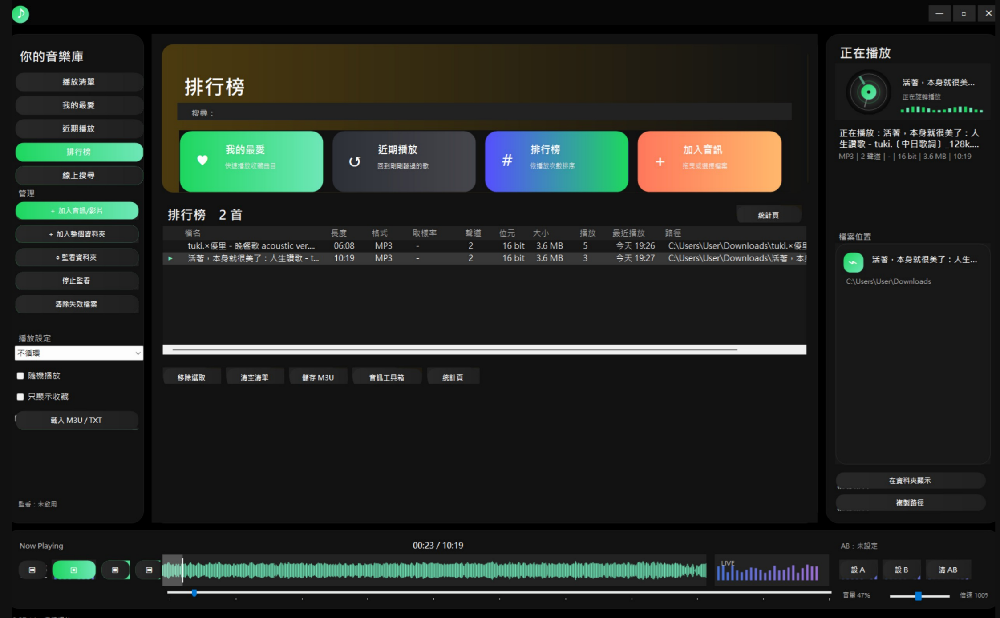
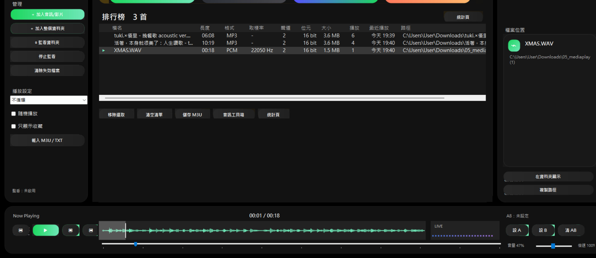
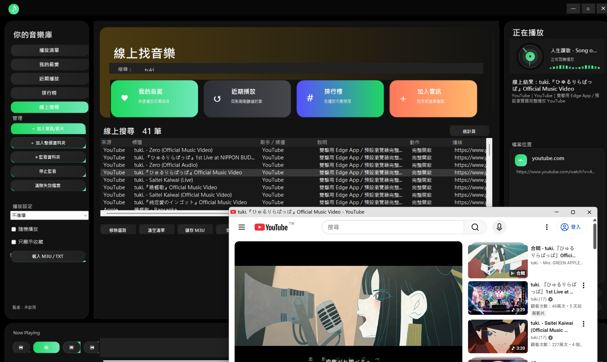
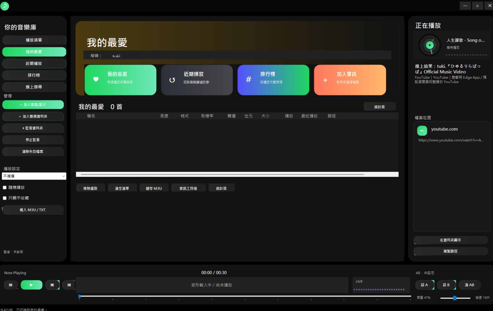
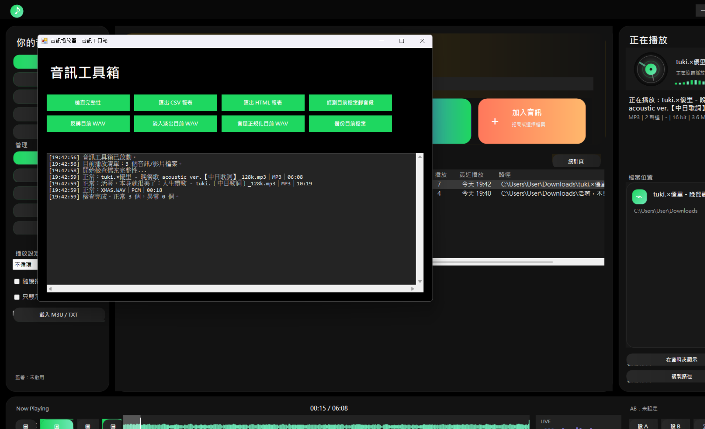
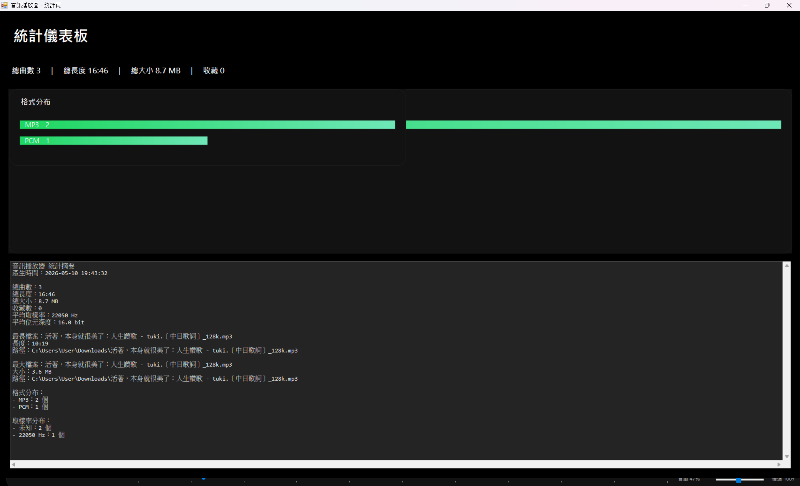

# 音訊播放器

一個使用 C# / WinForms 製作的桌面音訊播放器。  
一開始是以 WAV 播放器為主，後來逐步加入 MP3、MP4、本機播放清單、線上搜尋、波形預覽、排行榜、近期播放與音訊工具箱等功能。

這個專案的目標不是做成最複雜的播放器，而是嘗試在 **不依賴額外 NuGet 套件** 的前提下，把 WinForms 做出比較接近現代音樂播放器的使用體驗。

---

## 畫面截圖

> 以下區塊預留給專案截圖，之後可以把圖片放到 `docs/screenshots/` 資料夾，再修改圖片路徑。

### 主畫面

### 播放清單與波形圖

### 線上搜尋

### 我的最愛 / 近期播放 / 排行榜

### 音訊工具箱

### 統計儀表板

---

## 主要功能

### 本機音訊播放

目前支援以下格式：

- `.wav`
- `.mp3`
- `.mp4`

WAV 使用 Windows 內建的 MCI 播放，MP3 / MP4 則透過 Windows Media Player COM 元件播放。  
MP4 目前以音軌播放為主，不顯示影片畫面。

支援的基本操作包含：

- 播放 / 暫停 / 停止
- 上一首 / 下一首
- 隨機播放
- 單曲循環 / 清單循環
- 音量調整
- 倍速調整
- 靜音切換
- 進度條跳轉
- 點擊波形圖跳轉播放位置

---

### 播放清單管理

播放器可以從檔案、資料夾或拖曳方式加入音訊檔案。加入資料夾時會自動掃描子資料夾中的支援格式。

播放清單功能包含：

- 加入單一或多個音訊檔
- 加入整個資料夾
- 拖曳檔案 / 資料夾加入
- 即時搜尋播放清單
- 移除選取歌曲
- 清空播放清單
- 清除已失效檔案
- 載入 M3U / TXT 清單
- 儲存 M3U 清單
- 右鍵選單操作：
  - 播放
  - 切換收藏
  - 在檔案總管中顯示
  - 複製路徑
  - 移除

---

### 我的最愛、近期播放與排行榜

播放清單不只是一個檔案列表，也會記錄一些使用狀態。

- **我的最愛**：可將常聽歌曲加入收藏。
- **近期播放**：播放歌曲後會記錄最近播放時間。
- **排行榜**：依照播放次數排序，方便查看最常播放的歌曲。

播放次數與最近播放時間會直接顯示在清單中，關閉程式後也會保存，下次開啟時自動還原。

---

### 波形圖與視覺化

播放器會為音訊產生波形預覽：

- WAV：讀取 PCM 資料產生較精準波形
- MP3：產生預覽用波形
- 播放時顯示目前播放位置
- 可點擊波形圖跳轉到指定時間

右側「正在播放」區塊加入了旋轉唱片風格的動畫，底部也有簡易的 Live Visualizer，讓播放狀態比較直覺。

---

### A/B 循環

可以設定 A 點與 B 點，讓播放器在指定區段中重複播放。

這個功能適合：

- 聽寫練習
- 語言學習
- 樂句重複練習
- 檢查音訊片段

---

### 線上搜尋

線上搜尋主要是作為本機播放器的補充功能。  
當電腦有網路時，可以搜尋不同來源的線上內容；如果沒有網路，程式會自動回到離線模式，只保留本機播放功能。

目前整合的來源包含：

| 來源 | 行為 |
|---|---|
| YouTube | 顯示搜尋結果，雙擊後使用瀏覽器 / Edge App 開啟完整版 |
| Apple Music / iTunes | 顯示搜尋結果，雙擊後在播放器內播放官方預覽音源 |
| Spotify | 顯示搜尋入口；若未設定 API 金鑰則不列出完整結果 |
| Audius | 可搜尋並嘗試在播放器內播放完整音訊 |
| Internet Archive | 可搜尋公開音訊資料並播放 |
| Radio Browser | 可搜尋網路電台並播放直播串流 |
| Apple Podcasts | 可搜尋 Podcast，並播放公開單集音訊 |

線上平台的播放方式會依照官方提供的資料而有所不同。  
例如 Apple Music / iTunes Search API 只提供預覽音源，因此程式只能播放 preview；YouTube 與 Spotify 不直接提供可放入 WinForms 播放器的完整音訊串流，所以採用外部開啟或入口方式處理。

---

### 音訊工具箱

音訊工具箱提供一些和音訊檔案整理、檢查有關的功能：

- 檢查播放清單檔案完整性
- 匯出 CSV 報表
- 匯出 HTML 報表
- 偵測目前 WAV 檔案的靜音片段
- 反轉 WAV
- 淡入 / 淡出 WAV
- 音量正規化 WAV
- 備份目前檔案

目前音訊編輯功能主要針對 WAV PCM 檔案設計。

---

### 統計儀表板

統計頁會整理目前音樂庫資訊，例如：

- 檔案數量
- 總播放長度
- 總檔案大小
- 收藏數量
- 格式分布
- 其他播放清單統計資訊

---

## 介面設計

這版介面參考了 Spotify / Apple Music 類型播放器的版面邏輯，但仍以 WinForms 能穩定完成為前提。

主要設計方向：

- 深色主題
- 左側音樂庫導覽
- 中央播放清單與搜尋結果
- 右側正在播放資訊
- 底部固定播放器列
- 自訂確認 / 錯誤提示視窗
- 旋轉唱片播放動畫
- 自繪時間顯示，降低 Label 閃爍問題

檔案選擇、資料夾選擇與儲存視窗仍保留 Windows 原生對話框。  
這樣做是為了避免自製檔案瀏覽器在 OneDrive、捷徑、權限、中文路徑或不同 Windows 環境下出現相容性問題。

---

## 自動儲存狀態

程式關閉時會記錄下列資訊：

- 播放清單
- 收藏歌曲
- 音量
- 倍速
- 隨機播放狀態
- 循環模式
- 監看資料夾
- 播放次數
- 最近播放時間
- 近期播放紀錄

下次開啟時會自動還原。

---

## 快捷鍵

| 快捷鍵 | 功能 |
|---|---|
| `Space` | 播放 / 暫停 |
| `Ctrl + O` | 加入檔案 |
| `Ctrl + F` | 聚焦搜尋框 |
| `Right` | 快轉 5 秒 |
| `Left` | 倒退 5 秒 |
| `N` | 下一首 |
| `P` | 上一首 |
| `Enter` | 播放目前選取項目 |
| `Delete` | 移除播放清單中選取項目 |

---

## 開發環境

- Visual Studio
- .NET Framework 4.7.2
- C# 7.3
- Windows Forms

---

## 執行方式

1. 使用 Visual Studio 開啟方案。
2. 確認目標框架為 `.NET Framework 4.7.2`。
3. 建置方案。
4. 執行專案。

本專案不需要額外安裝 NuGet 套件。

---

## 注意事項

- MP3 / MP4 播放依賴 Windows Media Player COM 元件。
- 若 Windows 未啟用 Media Features，MP3 / MP4 可能無法播放。
- MP4 目前只播放音軌，不顯示影片畫面。
- WAV 編輯工具主要支援 WAV PCM。
- 部分特殊編碼的音訊檔可能因系統解碼器支援度不同而無法播放。
- 線上搜尋需要網路；無網路時會自動切換為離線模式。
- YouTube / Spotify / Apple Music 等商業平台不提供可直接放入本機播放器完整播放的音訊 URL，因此程式會依各平台限制採取預覽或外部開啟方式。

---

## 授權

本專案主要作為課程作業與 WinForms 音訊播放器實作範例使用。
